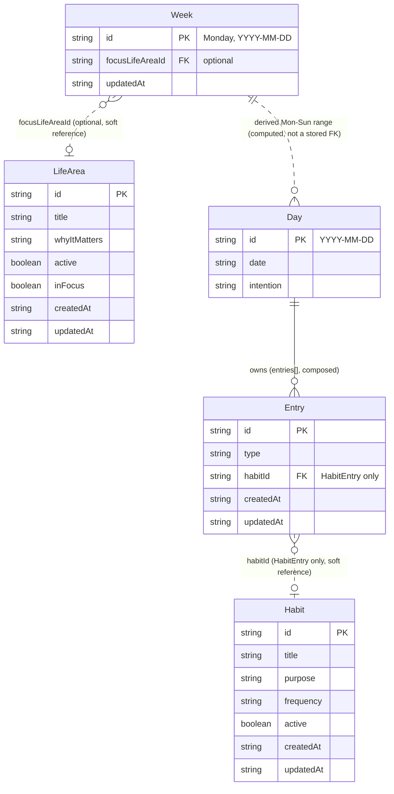

# Domain Map

This document describes the Proyecto SER domain model **as implemented today**. Where `DOMAIN_MODEL.md` is the conceptual product vision ("no implementation details"), this document is its technical counterpart: real types, real storage keys, real references.

Scope: `Day`, `Week`, `Entry`, `Habit`, `LifeArea` — the five domains that currently exist under `lib/domain/`. Two adjacent pieces are mentioned only where relevant to the relationships below, not described in full: `LifeDirection` (`lib/domain/direction/`), the single personal-direction statement, and the hardcoded ritual-activity list (`lib/day.ts`), which is not a persisted domain at all.

All persistence in the app goes through one generic adapter, `lib/storage/storage.ts`, backed by `localStorage`. Every domain below has its own dedicated key and its own storage file — there is no shared or overloaded storage.

---

## Day

**Files:** `lib/domain/day/day.ts` (type + factory), `lib/domain/day/day-storage.ts` (CRUD), `lib/domain/day/day-migrations.ts` (legacy normalization + merge), `lib/domain/day/day-habits.ts` and `lib/domain/day/day-reflection.ts` (narrow helpers for specific Entry types).

**Identity:** `Day.id` and `Day.date` — always equal, a canonical local `YYYY-MM-DD` key (`getLocalDateKey()` in `lib/date.ts`). Never a locale-formatted display string.

**Persistence:** `localStorage["ser.days"]` → `Record<string, Day>`, keyed by the canonical date.

**Shape:**
```ts
interface Day {
  id: string;
  date: string;
  entries: Entry[];
  journal: { mood: string; entry: string; closing: string };
  rituals: { checks: boolean[] };
  intention: string;
}
```

**Responsibilities:** the single record of "how the user lived one calendar day." It owns two coexisting representations of the same data:
- `entries[]` — the modern, Entry-based model (Journal/Habit/Ritual/Intention/Reflection).
- `journal` / `rituals` / `intention` — legacy scalar fields that predate the Entry model and are still the live write target for Today's ritual checkboxes/intention textarea and Journal's draft fields.

`day-migrations.ts` reconciles the two on every read: it independently backfills a missing Journal/Ritual/Intention `Entry` from the legacy fields (without ever letting fresh writes to those fields go un-migrated, even after other entry types like Habit/Reflection already exist for that day), and it normalizes any legacy locale-string date key into the canonical `YYYY-MM-DD` form, merging two raw records if a legacy-keyed and canonical-keyed record both resolve to the same calendar day.

**References out:** none. Day is referenced *by* Week (derived, not stored — see below), never the reverse.

---

## Week

**Files:** `lib/domain/week/week.ts` (type + factory), `lib/domain/week/week-storage.ts` (`getWeek`, `updateWeek`).

**Identity:** `Week.id` — the Monday that starts the week, as a canonical `YYYY-MM-DD` key (`getWeekStartKey()` in `lib/date.ts`).

**Persistence:** `localStorage["ser.weeks"]` → `Record<string, Week>`.

**Shape:**
```ts
interface Week {
  id: string;
  reflection: { wentWell: string; difficult: string; nextWeekFocus: string };
  focusLifeAreaId?: string;
  updatedAt: string;
}
```

**Responsibilities:** owns exactly two things the user writes directly on the Weekly Review page — the three-prompt weekly reflection, and an optional reference to the Life Area they want to care for that week. Week owns **no daily data**: the "weekly context" shown in `WeeklyReviewView` (which days had a journal entry, which had a closing reflection, which practices were sustained) is computed at render time from `Day` records for that week's seven date keys, never persisted on Week.

**References out:** `focusLifeAreaId?` → `LifeArea.id`, optional, resolved via `getLifeArea()` at render time. The title is never copied into `Week`.

---

## Entry

**Files:** `lib/domain/entry/entry.ts` — type definitions and factory functions only. **Entry has no storage file of its own.**

**Identity:** `Entry.id`, a deterministic string the owning feature builds as `${dayCanonicalKey}:${kind}[:extra]` — e.g. `2026-07-11:journal`, `2026-07-11:habit:<habitId>`, `2026-07-11:ritual:0`, `2026-07-11:intention`, `2026-07-11:reflection`.

**Persistence:** not independent. Entry records live only inside `Day.entries[]`, persisted as part of that day's record under `ser.days`. There is no `ser.entries` key.

**Shape:** a discriminated union on `type`, all extending `BaseEntry { id, type, createdAt, updatedAt }`:
- `JournalEntry` — `{ mood, content, closingReflection }`
- `HabitEntry` — `{ habitId, completed }`
- `RitualEntry` — `{ ritualId, completed }`
- `IntentionEntry` — `{ content }`
- `ReflectionEntry` — `{ content }` (the Day's closing reflection — distinct from `JournalEntry.closingReflection`, which belongs to a specific Journal writing session)

**Responsibilities:** the atomic "meaningful interaction" unit — each variant represents one thing that happened on a given day. This is the modern replacement for `Day`'s legacy scalar fields, not yet the sole source of truth (see Day, above).

**References out:** `HabitEntry.habitId` → `Habit.id`, resolved via `getHabit()`/`getHabits()`. `RitualEntry.ritualId` is **not** a reference to any stored entity — it's a synthetic positional string (`"ritual:<index>"`); see Missing Relationships.

---

## Habit

**Files:** `lib/domain/habit/habit.ts` (type + factory), `lib/domain/habit/habit-storage.ts` (`getHabits`, `getHabit`, `saveHabit`, `updateHabit`, `removeHabit` — the last currently unused by any UI).

**Identity:** `Habit.id`, a `crypto.randomUUID()` value.

**Persistence:** `localStorage["ser.habits"]` → `Record<string, Habit>`.

**Shape:**
```ts
interface Habit {
  id: string;
  title: string;
  purpose: string;
  frequency: "daily" | "weekly";
  active: boolean;
  createdAt: string;
  updatedAt: string;
}
```

**Responsibilities:** the definition of a recurring practice, managed entirely on `/habits` (create, edit, archive, reactivate). Completion on any given day is **not** stored on Habit — it's a `HabitEntry` on that day's `Day.entries`, referencing the habit by id. Archiving a Habit never touches or deletes past `HabitEntry` records.

**References out:** none. Habit is referenced *by* `Entry.habitId` (on `HabitEntry`); nothing on Habit points to LifeArea, Week, or Day.

---

## LifeArea

**Files:** `lib/domain/life-area/life-area.ts` (type + factory), `lib/domain/life-area/life-area-storage.ts` (`getLifeAreas`, `getLifeArea`, `saveLifeArea`, `updateLifeArea`).

**Identity:** `LifeArea.id`, a `crypto.randomUUID()` value.

**Persistence:** `localStorage["ser.life-areas"]` → `Record<string, LifeArea>`.

**Shape:**
```ts
interface LifeArea {
  id: string;
  title: string;
  whyItMatters: string;
  active: boolean;
  inFocus: boolean;
  createdAt: string;
  updatedAt: string;
}
```

**Responsibilities:** a user-defined area of life worth caring for, managed on `/direction` (create, edit, archive, reactivate, mark "en foco"). Deliberately has no fixed taxonomy and no numeric limit on how many areas can be in focus.

**References out:** none. LifeArea is referenced *by* `Week.focusLifeAreaId`; nothing on LifeArea points to Habit, Day, or Entry.

---

## Entity-Relationship Diagram



Solid line (`--`) = structural ownership: the child is physically stored inside the parent's record. Dashed line (`..`) = a soft, id-only reference resolved at render time — no referential integrity is enforced anywhere in this codebase; a dangling id degrades gracefully (see `WeeklyFocusAreaModule`'s archived-area handling) rather than crashing.

---

## Existing Relationships

1. **Day → Entry** (structural, 1-to-many). Entry has no independent storage; it exists only as elements of `Day.entries[]`.
2. **Entry (HabitEntry) → Habit** (soft reference, many-to-one via `habitId`). Resolved live through `getHabit()`/`getHabits()`; the habit's title/purpose is never copied into the Entry.
3. **Week → LifeArea** (soft reference, zero-or-one via `focusLifeAreaId`). Resolved live through `getLifeArea()`; the area's title is never copied into Week. Archived areas still resolve correctly (M5.1) — the reference degrades to a labeled "(archivada)" display, not a broken link.
4. **Week → Day** (derived, not persisted). `WeeklyReviewView` computes the week's seven canonical day keys from `Week.id` (`getWeekDayKeys()`) and reads each `Day` independently via `getDay()`. No id anywhere stores this relationship — it is pure date arithmetic on the Week's own identity, recomputed every time.

## Missing Relationships

Gaps in the current model — not explicitly deferred by any shipped milestone, just not built:

1. **Habit → LifeArea**: no field on `Habit` references a `LifeArea`. A habit cannot currently be said to belong to a life area.
2. **Day.intention / IntentionEntry → LifeArea**: the daily intention has no connection to any life area.
3. **JournalEntry / ReflectionEntry → LifeArea**: same gap for daily journal writing and the daily closing reflection — only the *weekly* reflection has a LifeArea link so far.
4. **Ritual has no persisted domain at all**: `RitualEntry.ritualId` is a synthetic positional string (`"ritual:<index>"`), not a foreign key to anything stored. The ritual activity list itself is hardcoded in `lib/day.ts` (`getCurrentDay()`), not user-editable or persisted per user — unlike Habit, which is a full CRUD domain. This is a structural asymmetry between two conceptually similar features.
5. **LifeDirection ↔ LifeArea**: the personal-direction statement and the life-area list live on the same `/direction` page but have no structural relationship — they're visually adjacent, not connected in the data model.

## Intentionally Deferred Relationships

Explicitly named as future work in the milestones that shipped this code — not gaps, but scoped-out decisions:

1. **Showing `Week.focusLifeAreaId` in Today** — M5.1 explicitly required this not be done yet ("Do not yet show the selected weekly area in Today").
2. **Attaching Habits to Life Areas** — explicitly named in M5.1 as "a later decision," separate from connecting Week to LifeArea.
3. **Any Day-level (not just Week-level) reference to a LifeArea** — implied by the same scoping; M5's own requirements restricted integration to "Weekly Review only, not the daily record."
4. **A Month/monthly-review domain** — flagged as a future extension point when Weekly Review shipped, explicitly not built yet per the current product direction (Life Direction was prioritized first).
