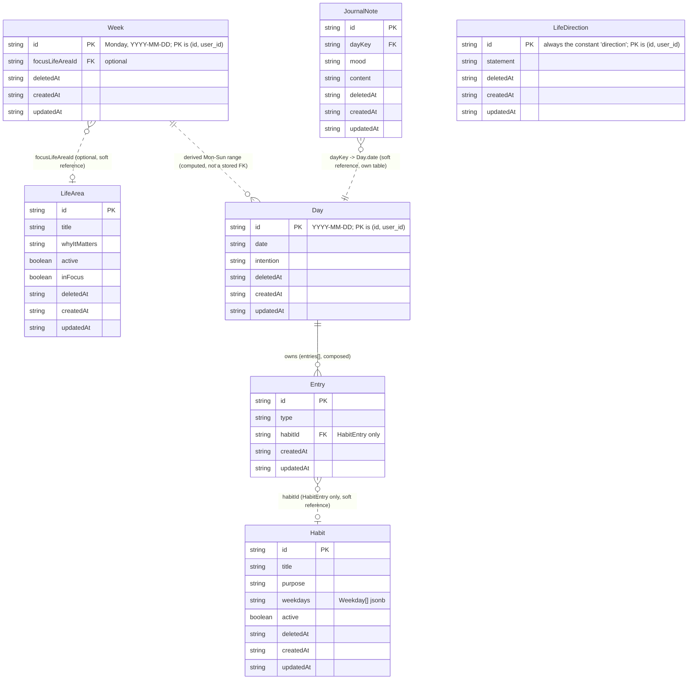

# Domain Map

This document describes the Proyecto SER domain model **as implemented today**. Where `DOMAIN_MODEL.md` is the conceptual product vision ("no implementation details"), this document is its technical counterpart: real types, real storage keys, real references.

Scope: `Day`, `Week`, `Entry`, `Habit`, `LifeArea`, `Journal`, `LifeDirection` — every domain that exists under `lib/domain/`, plus `Profile` (`lib/domain/profile/`), described separately below since it doesn't follow the same storage pattern. The hardcoded ritual-activity list (`lib/day.ts`) is mentioned only where relevant — it is not a persisted domain at all.

---

## Cloud synchronization

Six domains — **Day, Week, Habit, LifeArea, Journal, LifeDirection** — are cloud-synced through one shared engine, `lib/sync/createSyncedStore.ts`. Each domain's `*-storage.ts` file supplies only what's specific to it (a `normalize` function, `fromRow`/`toRow` mappers, the Supabase table name); everything else — memory cache, localStorage persistence, the pending-push queue, and pull/merge — is the same unmodified code shared by all six:

```
domain (type + factory)
   ↓
storage adapter (normalize, fromRow, toRow)
   ↓
createSyncedStore (memory → localStorage → Supabase)
   ↓
Supabase (per-domain table, RLS-scoped to auth.uid())
   ↓
UI (unchanged — never imports Supabase directly)
```

- **Reads** (`getAll`/`getOne`) only ever touch an in-memory cache backed by `localStorage` — never the network.
- **Writes** (`save`/`update`/`remove`) update memory and `localStorage` synchronously, then fire an async, best-effort push to Supabase. A push that fails is marked in a small pending-id set, retried on the next `pull()`.
- **Conflict resolution is exactly one rule everywhere: newest `updatedAt` wins.** No domain has its own merge logic.
- **Deletion is tombstone-only** (`deletedAt` timestamp) — no domain ever hard-deletes a row, locally or in Supabase.
- **Every localStorage key is namespaced by the signed-in user** (`<key>::<userId>`), so switching accounts on one device can't leak data between them. A device's first sign-in for a given key inherits whatever was under the old flat (pre-sync) key.
- **Bootstrap** happens once per session start in `lib/auth/AuthContext.tsx`, which holds a single `SYNCED_DOMAINS` registry (`{setUserId, migrateToCloud, pull}` per domain) — adding a future synced domain means adding one entry there, not editing several call sites. The one ordering rule: Day must migrate before Journal, since Journal's own one-time migration reads `getAllDays()`.
- **The one-time historical upload** (`migrateToCloud`) is gated by a single `profile.migrationCompleted` boolean, shared across all six domains — it exists purely to avoid redundant re-uploads on every login (each domain's upload is independently idempotent, so re-running it is always safe, just wasteful). This flag was designed for the one-time "device already had local data before cloud sync existed" case; if a *new* seventh domain is added after some users' flag is already `true`, that domain would need to run its own migration unconditionally (or introduce its own flag) rather than relying on the shared one, since the shared flag will already read as "done" for existing accounts.

**Profile** (`lib/domain/profile/`) is the one domain that does **not** use `createSyncedStore` — it talks to Supabase directly on every read/write, with no local cache. This is deliberate, not an oversight: Profile is read synchronously during auth bootstrap to decide whether to show onboarding, before the rest of the app is usable at all — there's no meaningful "offline profile" state to fall back to, and a stale cached profile is exactly the wrong thing to gate onboarding on. Every other domain's offline-first behavior is unaffected: if the Profile fetch fails, `OnboardingGate` treats a missing profile the same as "onboarding not needed" and renders the app normally.

---

## Day

**Files:** `lib/domain/day/day.ts` (type + factory), `lib/domain/day/day-storage.ts` (CRUD), `lib/domain/day/day-migrations.ts` (legacy normalization + merge), `lib/domain/day/day-habits.ts` and `lib/domain/day/day-reflection.ts` (narrow helpers for specific Entry types).

**Identity:** `Day.id` and `Day.date` — always equal, a canonical local `YYYY-MM-DD` key (`getLocalDateKey()` in `lib/date.ts`). Never a locale-formatted display string.

**Persistence:** cloud-synced via `createSyncedStore` — `localStorage["ser.days::<userId>"]` → `Record<string, Day>` (cache), Supabase table `days` (source of truth across devices). `id` is a calendar date key, unique only *within* one user's rows, not globally — the `days` table's primary key is `(id, user_id)`, not `id` alone.

**Shape:**
```ts
interface Day {
  id: string;
  date: string;
  entries: Entry[];
  journal: { mood: string; entry: string; closing: string };
  rituals: { checks: boolean[] };
  intention: string;
  deletedAt: string | null;
  createdAt: string;
  updatedAt: string;
}
```

**Responsibilities:** the single record of "how the user lived one calendar day." It owns two coexisting representations of the same data:
- `entries[]` — the modern, Entry-based model (Journal/Habit/Ritual/Intention/Reflection).
- `journal` / `rituals` / `intention` — legacy scalar fields that predate the Entry model and are still the live write target for Today's ritual checkboxes/intention textarea and Journal's draft fields.

`day-migrations.ts` reconciles the two on every read: it independently backfills a missing Journal/Ritual/Intention `Entry` from the legacy fields (without ever letting fresh writes to those fields go un-migrated, even after other entry types like Habit/Reflection already exist for that day), and it normalizes any legacy locale-string date key into the canonical `YYYY-MM-DD` form, merging two raw records if a legacy-keyed and canonical-keyed record both resolve to the same calendar day.

**References out:** none. Day is referenced *by* Week (derived, not stored — see below), never the reverse.

---

## Week

**Files:** `lib/domain/week/week.ts` (type + factory), `lib/domain/week/week-storage.ts` (`getWeek`, `updateWeek`).

**Identity:** `Week.id` — the Monday that starts the week, as a canonical `YYYY-MM-DD` key (`getWeekStartKey()` in `lib/date.ts`).

**Persistence:** cloud-synced via `createSyncedStore` — `localStorage["ser.weeks::<userId>"]` → `Record<string, Week>` (cache), Supabase table `weeks`. `id` is the week-start date key — same collision reasoning as Day, so the primary key is `(id, user_id)`.

**Shape:**
```ts
interface Week {
  id: string;
  reflection: { wentWell: string; difficult: string; nextWeekFocus: string };
  focusLifeAreaId?: string;
  deletedAt: string | null;
  createdAt: string;
  updatedAt: string;
}
```

**Responsibilities:** owns exactly two things the user writes directly on the Weekly Review page — the three-prompt weekly reflection, and an optional reference to the Life Area they want to care for that week. Week owns **no daily data**: the "weekly context" shown in `WeeklyReviewView` (which days were written on, which practices were sustained) is computed at render time from `Day` records for that week's seven date keys, never persisted on Week.

**References out:** `focusLifeAreaId?` → `LifeArea.id`, optional, resolved via `getLifeArea()` at render time. The title is never copied into `Week`.

---

## Entry

**Files:** `lib/domain/entry/entry.ts` — type definitions and factory functions only. **Entry has no storage file of its own.**

**Identity:** `Entry.id`, a deterministic string the owning feature builds as `${dayCanonicalKey}:${kind}[:extra]` — e.g. `2026-07-11:journal`, `2026-07-11:habit:<habitId>`, `2026-07-11:ritual:0`, `2026-07-11:intention`, `2026-07-11:reflection`.

**Persistence:** not independent. Entry records live only inside `Day.entries[]`, persisted as part of that day's record (cloud-synced along with the rest of `Day`, see above). There is no separate Entry table or storage key.

**Shape:** a discriminated union on `type`, all extending `BaseEntry { id, type, createdAt, updatedAt }`:
- `JournalEntry` — `{ mood, content, closingReflection }` — **legacy/inert**: since the Journal domain migration, new journal notes are never written here (see Journal, below); a `JournalEntry` only still appears in `Day.entries` for days that had one before that migration, and nothing reads it anymore.
- `HabitEntry` — `{ habitId, completed }`
- `RitualEntry` — `{ ritualId, completed }`
- `IntentionEntry` — `{ content }`
- `ReflectionEntry` — `{ content }` (a Day's closing reflection). **Read-only legacy.** Nothing writes one any more: the feature was removed once it was found to be unreachable, and `day-reflection.ts` is deleted. The type survives so the export can still surface sentences written by older versions.

**Responsibilities:** the atomic "meaningful interaction" unit — each variant represents one thing that happened on a given day. This is the modern replacement for `Day`'s legacy scalar fields, not yet the sole source of truth (see Day, above) — except `JournalEntry`, which Journal has fully superseded.

**References out:** `HabitEntry.habitId` → `Habit.id`, resolved via `getHabit()`/`getHabits()`. `RitualEntry.ritualId` is **not** a reference to any stored entity — it's a synthetic positional string (`"ritual:<index>"`); see Missing Relationships.

---

## Habit

**Files:** `lib/domain/habit/habit.ts` (type + factory), `lib/domain/habit/habit-storage.ts` (`getHabits`, `getHabit`, `saveHabit`, `updateHabit`, `removeHabit` — the last currently unused by any UI).

**Identity:** `Habit.id`, a `crypto.randomUUID()` value.

**Persistence:** cloud-synced via `createSyncedStore` — `localStorage["ser.habits::<userId>"]` → `Record<string, Habit>` (cache), Supabase table `habits`. `id` is a `crypto.randomUUID()`, globally unique, so the primary key is `id` alone.

**Shape:**
```ts
interface Habit {
  id: string;
  title: string;
  purpose: string;
  weekdays: Weekday[]; // 0 (Sun) – 6 (Sat); replaced the earlier "daily" | "weekly" frequency
  active: boolean;
  deletedAt: string | null;
  createdAt: string;
  updatedAt: string;
}
```

**Responsibilities:** the definition of a recurring practice, managed entirely on `/habits` (create, edit, archive, reactivate). Completion on any given day is **not** stored on Habit — it's a `HabitEntry` on that day's `Day.entries`, referencing the habit by id. Archiving a Habit never touches or deletes past `HabitEntry` records.

**References out:** none. Habit is referenced *by* `Entry.habitId` (on `HabitEntry`); nothing on Habit points to LifeArea, Week, or Day.

---

## LifeArea

**Files:** `lib/domain/life-area/life-area.ts` (type + factory), `lib/domain/life-area/life-area-storage.ts` (`getLifeAreas`, `getLifeArea`, `saveLifeArea`, `updateLifeArea`).

**Identity:** `LifeArea.id`, a `crypto.randomUUID()` value.

**Persistence:** cloud-synced via `createSyncedStore` — `localStorage["ser.life-areas::<userId>"]` → `Record<string, LifeArea>` (cache), Supabase table `life_areas`. `id` is a `crypto.randomUUID()`, globally unique, so the primary key is `id` alone.

**Shape:**
```ts
interface LifeArea {
  id: string;
  title: string;
  whyItMatters: string;
  active: boolean;
  inFocus: boolean;
  deletedAt: string | null;
  createdAt: string;
  updatedAt: string;
}
```

**Responsibilities:** a user-defined area of life worth caring for, managed on `/direction` (create, edit, archive, reactivate, mark "en foco"). Deliberately has no fixed taxonomy and no numeric limit on how many areas can be in focus.

**References out:** none. LifeArea is referenced *by* `Week.focusLifeAreaId` and `Habit`'s planned-but-not-built link (see Missing Relationships); nothing on LifeArea points to Habit, Day, or Entry.

---

## Journal

**Files:** `lib/domain/journal/journal.ts` (type + factory), `lib/domain/journal/journal-storage.ts` (`getJournalNotes`, `getJournalNotesForDayKey`, `saveJournalNote`, `updateJournalNote`, `removeJournalNote` — the last currently unused by any UI), `lib/domain/journal/journal-migrations.ts` (normalize + one-time legacy import from `Day.entries`).

**Identity:** `JournalNote.id`, a `crypto.randomUUID()` value.

**Persistence:** cloud-synced via `createSyncedStore` — `localStorage["ser.journal_entries::<userId>"]` → `Record<string, JournalNote>` (cache), Supabase table `journal_entries`. `id` is globally unique, so the primary key is `id` alone.

**Shape:**
```ts
interface JournalNote {
  id: string;
  dayKey: string;
  mood: string;
  content: string;
  deletedAt: string | null;
  createdAt: string;
  updatedAt: string;
}
```

**Responsibilities:** a single journal note, independent of any other note written the same day (a day can have any number). This is the domain's second life — before its own cloud migration, journal notes lived as `JournalEntry` records inside `Day.entries[]` (see Entry, above); that storage is now legacy and inert. The one-time migration to this domain lifted every existing `JournalEntry` out of every stored `Day`, preserving its original `id`/`createdAt`/`updatedAt`, and nothing has written to `Day.entries` for journal notes since.

**References out:** `dayKey` → `Day.date`, a soft reference (not structural containment) resolved by filtering, e.g. `getJournalNotesForDayKey(day.date)`. Deleting or losing a `Day` record does not delete its journal notes.

---

## LifeDirection

**Files:** `lib/domain/direction/direction.ts` (type + factory), `lib/domain/direction/direction-storage.ts` (`getLifeDirection`, `saveLifeDirection`), `lib/domain/direction/direction-migrations.ts` (normalize).

**Identity:** `LifeDirection.id` is always the fixed constant `"direction"` (`LIFE_DIRECTION_ID`) — there is exactly one `LifeDirection` per user, never a collection.

**Persistence:** cloud-synced via `createSyncedStore` — `localStorage["ser.direction::<userId>"]` → `Record<string, LifeDirection>` (cache, always exactly one entry), Supabase table `direction`. Because `id` is the same constant for every user, the primary key is `(id, user_id)` — the most extreme case of the reasoning behind Day/Week's composite key.

**Shape:**
```ts
interface LifeDirection {
  id: string; // always "direction"
  statement: string;
  deletedAt: string | null;
  createdAt: string;
  updatedAt: string;
}
```

**Responsibilities:** the user's own free-text answer to "toward what kind of life am I walking?", shown and edited on `/direction` above the Life Area list. Purely a singleton value object — no history, no versions.

**References out:** none. See Missing Relationships for the (currently absent) link between LifeDirection and LifeArea.

---

## Entity-Relationship Diagram



Solid line (`--`) = structural ownership: the child is physically stored inside the parent's record. Dashed line (`..`) = a soft, id-only reference resolved at render time — no referential integrity is enforced anywhere in this codebase; a dangling id degrades gracefully (see `WeeklyFocusAreaModule`'s archived-area handling) rather than crashing. `LifeDirection` has no relationships drawn — see Missing Relationships.

---

## Existing Relationships

1. **Day → Entry** (structural, 1-to-many). Entry has no independent storage; it exists only as elements of `Day.entries[]`.
2. **Entry (HabitEntry) → Habit** (soft reference, many-to-one via `habitId`). Resolved live through `getHabit()`/`getHabits()`; the habit's title/purpose is never copied into the Entry.
3. **Week → LifeArea** (soft reference, zero-or-one via `focusLifeAreaId`). Resolved live through `getLifeArea()`; the area's title is never copied into Week. Archived areas still resolve correctly (M5.1) — the reference degrades to a labeled "(archivada)" display, not a broken link.
4. **Week → Day** (derived, not persisted). `WeeklyReviewView` computes the week's seven canonical day keys from `Week.id` (`getWeekDayKeys()`) and reads each `Day` independently via `getDay()`. No id anywhere stores this relationship — it is pure date arithmetic on the Week's own identity, recomputed every time.
5. **JournalNote → Day** (soft reference, many-to-one via `dayKey`). Resolved live through `getJournalNotesForDayKey(day.date)`; JournalNote has its own storage and its own Supabase table — unlike `Entry`, it is not physically contained inside `Day`.

## Missing Relationships

Gaps in the current model — not explicitly deferred by any shipped milestone, just not built:

1. **Habit → LifeArea**: no field on `Habit` references a `LifeArea`. A habit cannot currently be said to belong to a life area.
2. **Day.intention / IntentionEntry → LifeArea**: the daily intention has no connection to any life area.
3. **JournalNote → LifeArea**: same gap for daily journal writing — only the *weekly* reflection has a LifeArea link so far.
4. **Ritual has no persisted domain at all**: `RitualEntry.ritualId` is a synthetic positional string (`"ritual:<index>"`), not a foreign key to anything stored. The ritual activity list itself is hardcoded in `lib/day.ts` (`getCurrentDay()`), not user-editable or persisted per user — unlike Habit, which is a full CRUD domain. This is a structural asymmetry between two conceptually similar features.
5. **LifeDirection ↔ LifeArea**: the personal-direction statement and the life-area list live on the same `/direction` page but have no structural relationship — they're visually adjacent, not connected in the data model.

## Intentionally Deferred Relationships

Explicitly named as future work in the milestones that shipped this code — not gaps, but scoped-out decisions:

1. **Attaching Habits to Life Areas** — explicitly named in M5.1 as "a later decision," separate from connecting Week to LifeArea.
2. **Any Day-level (not just Week-level) reference to a LifeArea** — implied by the same scoping; M5's own requirements restricted integration to "Weekly Review only, not the daily record."
3. **A Month/monthly-review domain** — flagged as a future extension point when Weekly Review shipped, explicitly not built yet per the current product direction (Life Direction was prioritized first).
